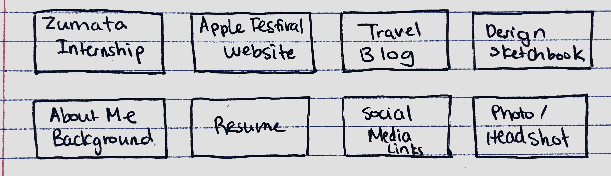
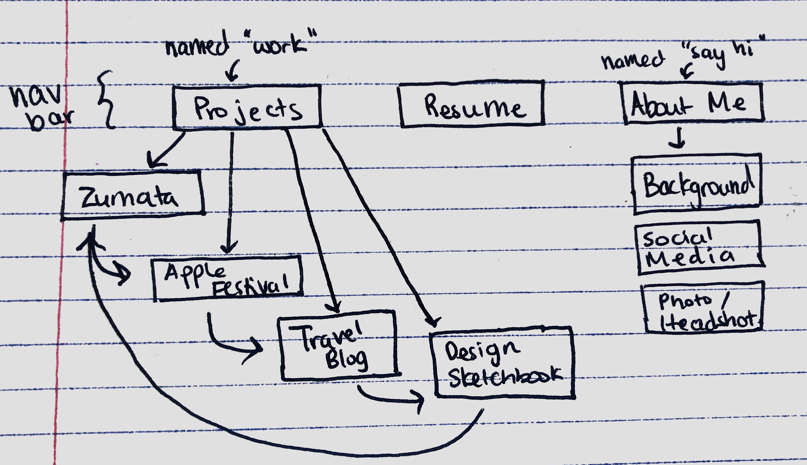
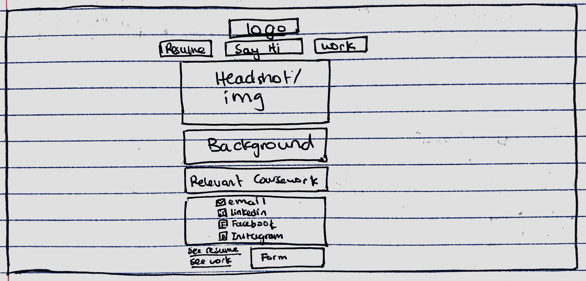
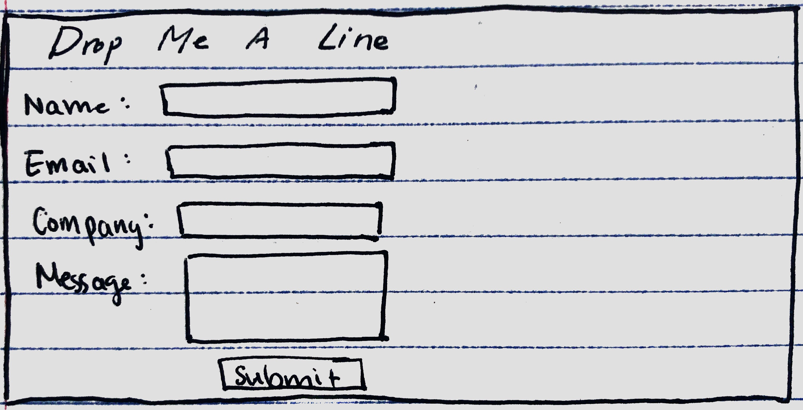
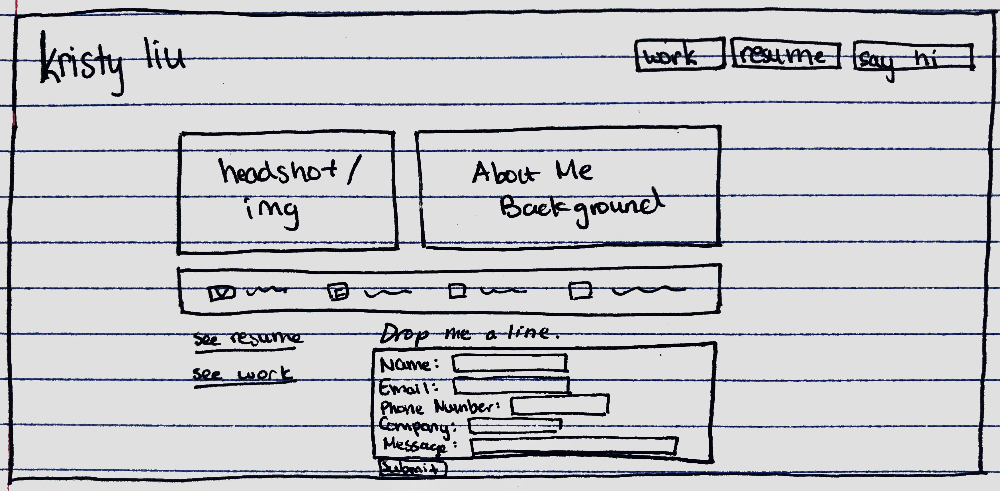
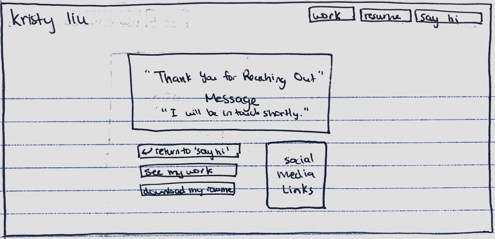

# Project 1: Design Journey

Your Name: Kristy Liu

**All images must be visible in Markdown Preview. No credit will be provided for images in your repository that are not properly linked in Markdown. Assume all file paths are case sensitive!**

[**Delete this markdown instructions section before you submit your final assignment.**]

This is a Markdown file. All written documents that you will submit this semester will be Markdown files. Markdown is a commonly used format by developers and bloggers. It's something that you should know.

The following links are Markdown references:
* <https://guides.github.com/features/mastering-markdown/>
* <https://github.com/adam-p/markdown-here/wiki/Markdown-Cheatsheet>

When writing your Markdown file in VS Code. Open the command palette and search for **Markdown: Open Preview**. This will open up a panel in Code where you can preview your formatted Markdown file.

This is how your insert images into your Markdown documents:

[**Delete this markdown instructions section before you submit your final assignment.**]

# Project 1, Milestone 1 - Design & Plan

## Website Topic

My website is a personal portfolio, and I am promoting myself as a college student seeking a summer internship in User Experience and Marketing.

## Target Audiences

One of my target audience is job recruiters for companies, for which I've already applied to the job and they came to the website from a link in my application. My second target audience is job recruiters, who bumped into my website and are looking to hire college students.

## Design Process

[Document your design process. Show us your sketches. Show us your card sorting. Show us the evolution of your design from your first idea (sketch) to design you wish to implement (sketch). Show us the process you used to organize content and plan the navigation (card sorting).]

[Thoroughly document this process. The _process_ is the important part of this assignment, not the final result.]

Design Process -- Card Sorting

Design Process -- Early Sketches
Default/About Me Page (titled: "say hi")

Form close up

Projects Page (titled: "work")

Zumata Project page

## Final Design Plan

[Include sketches of your final design here. Don't forget to design the form and its confirmation page!]

Design Process -- Final Sketches
Default/Projects Page (titled: "work")

About Me Page (titled: "say hi")

Form Confirmation Page

Zumata Project page

[Include your site navigation here. Describe the content on each page. Tip: use bulleted lists.]
Note: default page aka index.php is "work" page
<ol>
<li>work
<ul><li>4 boxes representing projects I worked on. Can click on the box to go to project page.</li></ul>
</li>
<li>resume<
<ul><li>Links to PDF of my resume</li></ul>
</li>
<li>say hi
<ul><li>Displays a picture of me, a description of my background, and my social media links. Also includes a contact form.</li></ul>
</li>
</ol>

## Target Audiences' Needs

[Tell us how your design meets the needs of both of your target audiences.]
My portfolio website design meets the needs of both my target audiences because I try to cater to both recruiters, who have already received my application/resume and those who have not. I include a very visible and accessible link to my resume by featuring it on the navigation bar for recruiters who don't have access to my resume. I also decided to make the default page, index.php, the "work" page that features all my past projects between the early and final stages of my sketches. The reason I did this is because I believe that regardless if the recruiter has seen an application from me or not, my work speaks best to my ability and the purpose of a portfolio is to showcase my past projects. Instead of naming the about page "about me," I also decided to name the page "say hi" in order to show a more casual/personal tone and imply that this page includes a contact form and more information about me. The design of the website is also colorful and the theme of being personable is consistent through the use of lowercase words and phrases such as "say hi" and "drop me a line." Although this might seem counterintuitive to the professional aspect of job recruiting, I believe my portfolio could act as a way for recruiters to more dynamically see my personality and ambition versus a resume. Therefore, I made these design choices, tone of voice, fonts, and navigation in order to cater to my audience: recruiters for jobs I've applied to and recruiters that came across my portfolio.

## Templates

The templates I will use are a header.php, which includes the title of my site and my navigation bar, which will be featured on every page.
The second template I will use is a footer with a link to my email.

# Project 1, Milestone 2 - Draft Website

## Sticky Form

[What fields are required for your form?]

Name (text field), Email (text field), Phone Number (input type tel), Company (text field), Message (text field)

[Plan out your error messages for your target audiences here.]

For name: Please enter your name.
For email: Please enter a valid email address.
[No error message] For phone number: Optional.
[No error message] For company: Optional.
For message: Please enter a brief message, so I know your reason for reaching out :)

## Validation Code Plan

[Write out your pseudocode plan for handling the validation of the form.]
When the user tries to submit the form:

  If name is empty:

    Show an error message for the "username" input that says "Please enter your name."

    Do not submit the form.

  Otherwise,

    Show no error message for the "username" input.

  If email is invalid:

    Show an error message for the "email" input that says "Please enter a valid email address."

    Do not submit the form.

  If message is not valid:

    Show an error message for the "message" input that says "Please enter a brief message, so I know your reason for reaching out :)"

    Do not submit the form.

  If no errors,

    Submit the form.

  Otherwise,

    do not submit the form.

# Final Submission: Complete & Polished Website

## Target Audiences

[Tell us how your final site meets the needs of the target audiences. Be specific here. Tell us how you tailored your design, content, etc. to make your website usable by both target audiences.]

## Reflection

[Take this time to reflect on what you learned during this assignment. How have you improved from 1300? What things did you have trouble with?]
